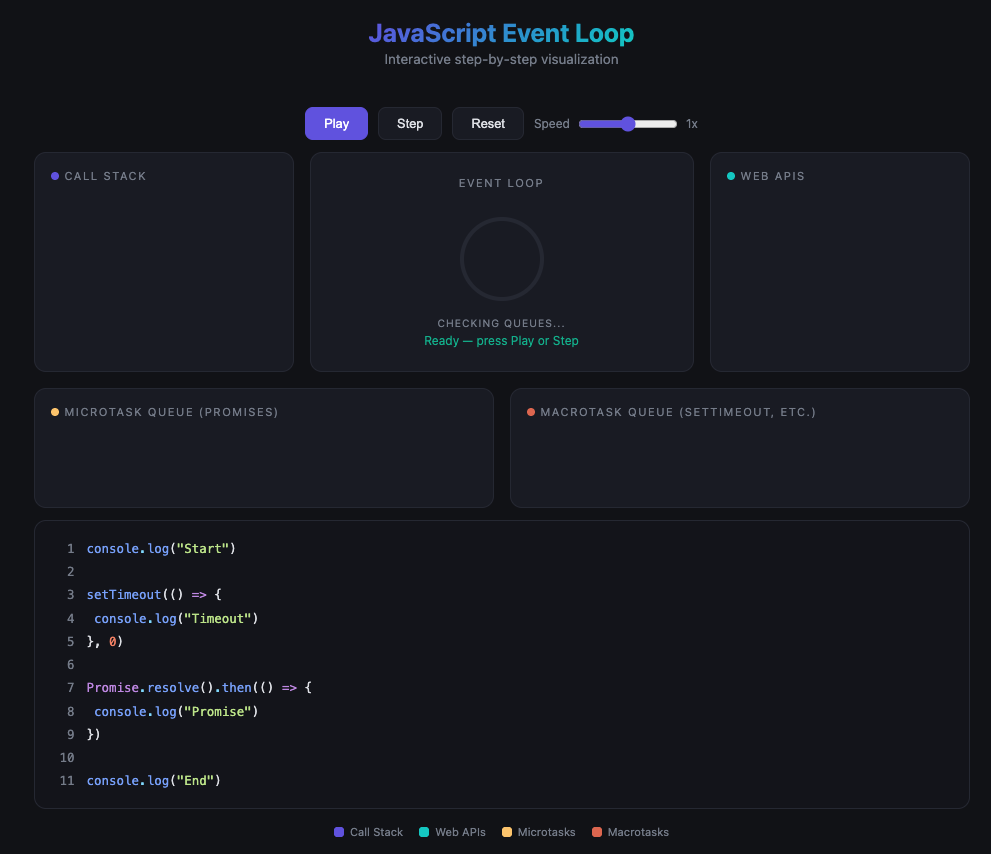

# JavaScript Event Loop — Interactive Animation

An interactive step-by-step visualization of the JavaScript Event Loop built with React and Vite. Watch how the Call Stack, Web APIs, Microtask Queue, and Macrotask Queue work together in real time.



## Features

- **Step-by-step execution** — Walk through each phase of the event loop at your own pace
- **Animated transfers** — Visual flying bubbles show items moving between panels (Call Stack, Web APIs, Queues)
- **Play / Pause / Step controls** — Auto-play with adjustable speed (0.5x – 2x), or advance one step at a time
- **Syntax-highlighted code** — The currently executing line is highlighted in the source code panel
- **Responsive design** — Works on desktop, tablet, and mobile

## How It Works

The visualization demonstrates this code:

```js
console.log("Start")

setTimeout(() => {
  console.log("Timeout")
}, 0)

Promise.resolve().then(() => {
  console.log("Promise")
})

console.log("End")
```

**Output order:** `Start` → `End` → `Promise` → `Timeout`

This shows how synchronous code runs first, then microtasks (Promises), then macrotasks (setTimeout) — the core behavior of the JavaScript event loop.

## Getting Started

```bash
npm install
npm run dev
```

## Tech Stack

- [React](https://react.dev)
- [Vite](https://vite.dev)
